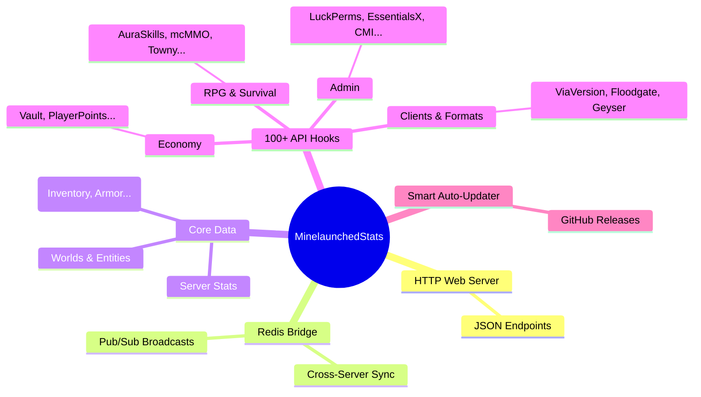

  <h1>📊 MinelaunchedStats</h1>
  
<b>L'Extracteur de Statistiques Ultime pour Serveurs Minecraft</b>

  
<i>Extrayez absolument tout depuis votre serveur sous forme d'API JSON. Compatible 1.8.8 à 1.20+</i>

  
   
  
  
  
  
  
  
   
  
  <h3>📚 <a href="docs.md">LIRE LA DOCUMENTATION COMPLÈTE (docs.md)</a> 📚</h3>

---

## 🌟 Aperçu

**MinelaunchedStats** est un plugin universel de haute performance conçu pour extraire une liste exhaustive de statistiques de votre serveur Minecraft et les exposer via une API HTTP JSON intégrée rapide ou via Redis.

Que vous souhaitiez créer un tableau de bord web personnalisé, surveiller votre infrastructure, ou intégrer des bots Discord, ce plugin vous donne **un accès sans précédent** aux données de votre serveur, sans causer de lag ni nécessiter de bases de données externes.

### ✨ Fonctionnalités Clés

- **🛡️ Compatibilité Universelle :** Fonctionne de la 1.8.8 aux toutes dernières versions (Spigot, Paper, Purpur, Pufferfish, Folia).
- **⚡ Serveur Web Natif :** Héberge un serveur Web léger directement dans le plugin. Pas besoin d'Apache ou de Nginx.
- **🌐 Bridge Redis :** Diffusez toutes les statistiques en direct sur un canal Pub/Sub Redis (Idéal pour BungeeCord/Velocity).
- **🪄 Architecture "Zero-Touch" :** 100+ plugins tiers supportés nativement. Le fichier de configuration s'auto-génère tout seul !
- **🚀 Auto-Updater :** Mises à jour OTA (Over-The-Air) intégrées directement depuis les Releases GitHub.
- **⏱️ Zéro-Lag :** La collecte des données utilise l'asynchrone et la Reflection. Le plugin ne fera jamais chuter vos TPS.

---

## 🧠 Architecture du Plugin (Mind Map)

---

## 🚀 Installation Rapide

1. Téléchargez le dernier `MinelaunchedStats.jar` depuis la page des [Releases](https://github.com/Minelaunched/Minelaunched-Stats/releases).
2. Placez le `.jar` dans le dossier `plugins/` de votre serveur.
3. Redémarrez votre serveur.
4. Ouvrez le fichier `plugins/MinelaunchedStats/config.yml` pour ajuster le port web (par défaut : `8080`).
5. Accédez à vos statistiques en naviguant vers l'IP et le port de votre serveur dans votre navigateur (ex: `http://votre-ip:8080/`).

## 📖 Comment utiliser ce plugin ?

L'utilisation, la configuration, et l'intégration de ce plugin sont massives. 
Nous avons rédigé une **Documentation Officielle Exhaustive** qui détaille :
- L'analyse complète du fichier de configuration auto-généré.
- Le dictionnaire complet des données JSON exportées.
- La liste complète des 100+ hooks et ce qu'ils font.
- Des **tutoriels avec code** (HTML/JS, Python, Node.js) pour apprendre à utiliser les données.
- Un **Guide Développeur** complet pour créer vos propres intégrations.

👉 **[Cliquez ici pour lire la Documentation Complète (docs.md)](docs.md)**

---

## 👨‍💻 Auteurs

Développé avec ❤️ par :
- **NeXoS_20**
- **Minelaunched**
